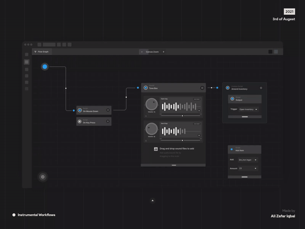
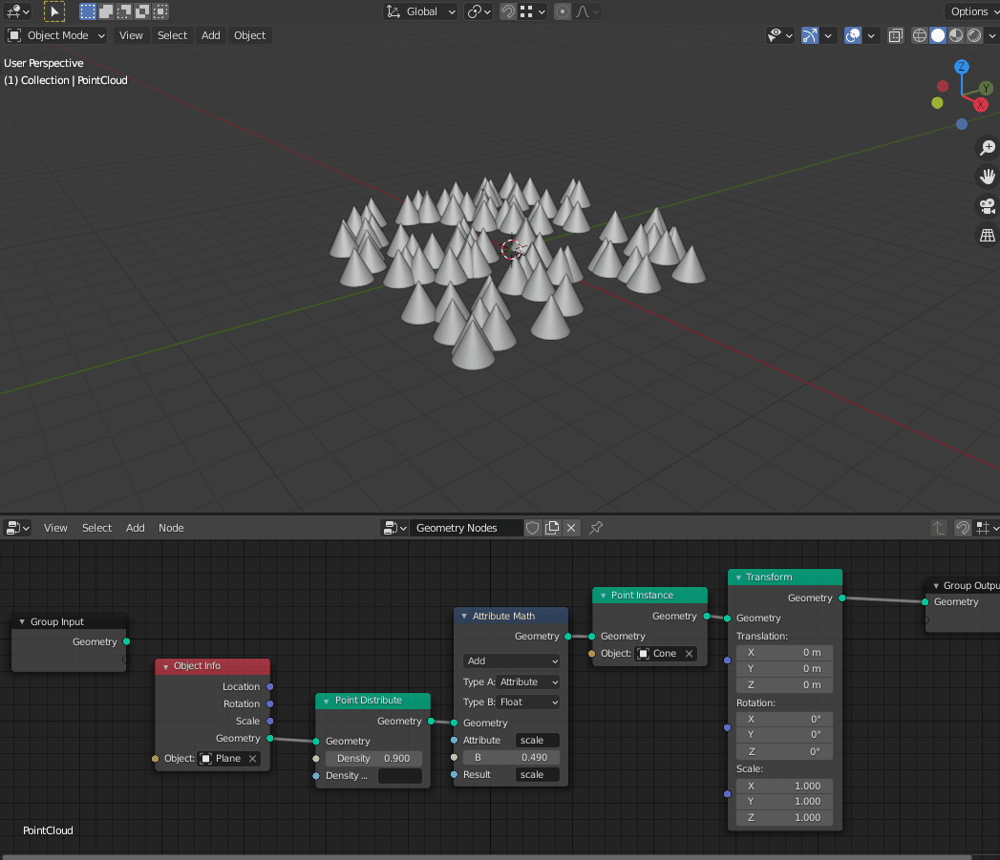
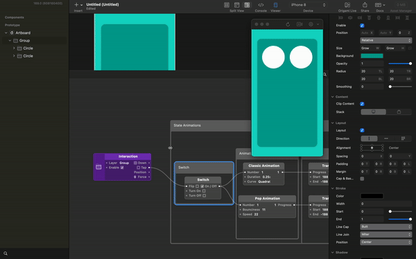
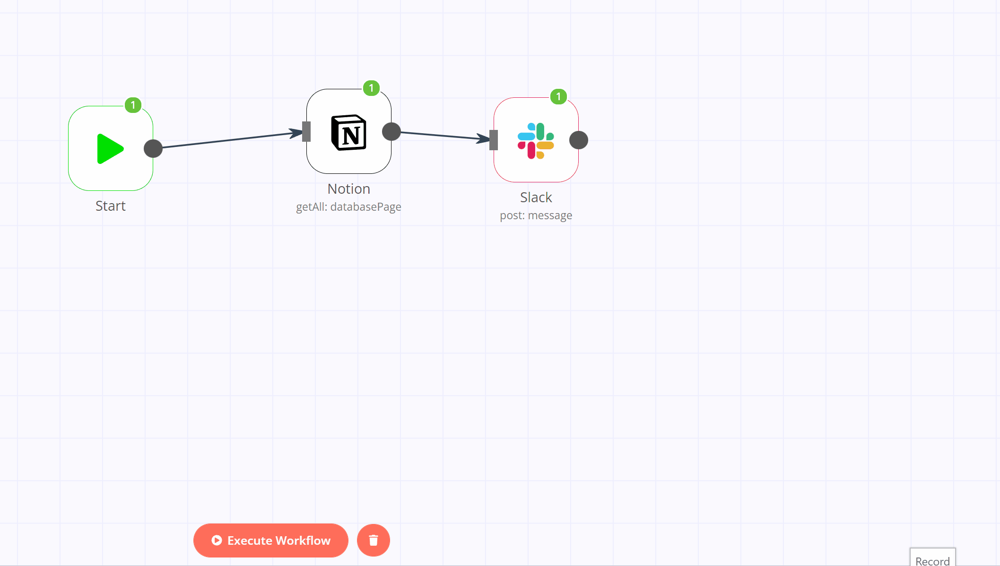

# Let's Hack Together a Flow Based Programming Runtime

## - Damilare Akinlaja

 [darmie](https://github.com/darmie)
𝕏 [fourEyedWiz](https://x.com/fourEyedWiz)

---

# Introduction

### Damilare Akinlaja

- 💻 Software engineer (obviously)
- 👾 ex. Game dev
- 🎮 Recent gamer
- 📙 Struggling author
- 🪄 Open sorcerer
- 🥷🏾 Wannabe otaku

---
# Agenda
- What the fuzz is Flow Based Programming?
  - Definition & history
  - FBP in the wild
  - FBP vs State Machines
- Demystifying FBP
  - Actor model (+ demo)
  - Simple FBP runtime (+ demo)
  - Optimization & scale
- Directed Graphs
  - Directed Acyclic Graphs
- Flow Based Programming Standardization
- Conclusion

---

# What the fuzz is Flow Based Programming?

**Flow Based Programming** is a paradigm of computer programming that defines an application as a network of black box processes or "data factories", exchanging data accross connections by message passing, where the connections are specified externally to the processes.

### Message Passing

Message passing is a technique for invoking a "behavior" by sending a message to it. A behavior may be defined as a function or an actor in which the invoking program rely on to perform tasks.

**[more reading >>](https://jpaulm.github.io/fbp/)**

---

# History of Flow Based Programming

- Invented in the early 1970's for a commercial bank by a Canadian, British-born computer systems architect and ex IBM employee, **[J. Paul Rodker Morisson](https://jpaulm.github.io/index.html)**
- Original inspiration came from IBM simulation languages, **[GPSS](https://en.wikipedia.org/wiki/GPSS)**

---

# FBP In The Wild

- Computer graphics & game development
- UX prototyping
- Worflow automation / Robotic Process automation
- Data processing
- Low/No Code app builders

---

# Unreal Engine

---

# Blender Nodes

reference: https://devtalk.blender.org/t/geometry-nodes/16108/173

---

# Origami

---

# n8n.io

reference: https://community.n8n.io/t/slack-node-sending-messages-twice/8432

---

# FBP vs FSM
### reference: https://www.quora.com/What-are-the-differences-between-Data-flow-model-and-State-machine-model

| Concept | Focus                                                    | Representation                                                                                                     | Behavior | Concurrency |
| ------- | -------------------------------------------------------- | ------------------------------------------------------------------------------------------------------------------ | -------- | ----------- |
| FBP     | focus on how data flows and is proccesed through systems | system is represented as a network of interconnected processes and how data transforms from one process to another |   system behavior is described by differences in data tranformation     |   multiple data transformations can occur simultaneously          |
| FSM     | focus on state transitions within a system               |        represents the current state of the system  and the transition between them                                                                                                          |    described by current state of the system and the input that cause the transition in states      |    state transitions occur sequentially         |

---

# Short Break 
# 🍔🍟☕️

---

# Demystifying FBP

---

# Actor Model
**Actor** is a mathematical computational model that defines an actor as a building block of concurrent computation. It typically encapsulates a behavior and it's ow private state. In response to a message, an actor can make decisions, process data and send messages to other actors.

Actors are expected to exist in isolation, but can send messages to other actors in the system by emitting messages. In an ideal implementation, messages should be sent and received asynchronously.

---

# Flow Based Runtime
A flow based runtime is a framework or engine for running and managing an FBP network. It orchestrates the routing of message passing between processes (actors). 

## Key Characteristics
* **Asynchronous execution**: Components typically run concurrently, processing data packets independently.
* **Dataflow management**: The runtime routes data packets based on connections, ensuring data reaches the correct components.
* **Bounded buffers**: The runtime might use buffers to temporarily hold data packets, preventing overwhelming components with too much data at once.
* **Error handling**: It should handle errors that occur within components or during data transfer.

---
# Directed Acyclic Graph (DAG)
DAG is a recipe for representing data flow in FBP. 

* **Nodes represent components**: Each node in the DAG corresponds to an individual component in the flow. These components perform specific operations on the data they receive.
* **Edges represent data flow**: Directed edges connect the nodes, indicating the direction in which data flows between components. Data is sent from one component (source) to another (destination) through these connections.
* **Acyclic property**: The "acyclic" part means there are no cycles in the graph. Data can only flow in one direction, preventing infinite loops or deadlocks in the execution.

---
## Benefits of using a DAG:

* **Visual debugging**: The DAG provides a clear visual representation of the entire data processing pipeline, making it easier to understand the flow and identify potential bottlenecks.
* **Efficient execution**: The flow-based runtime can leverage the DAG to optimize execution. It can identify independent tasks (components without incoming edges) and execute them concurrently, improving performance.
* **Error handling**: The DAG structure helps in error propagation. If an error occurs in a component, the runtime can trace it back through the DAG to identify the source and potentially take corrective actions.

---
## Complexity Management:

* **Granularity**: Breaking down logic into very small components can lead to overly complex and cluttered flow diagrams. This can make it difficult to understand and maintain the program, especially for larger projects.
Debugging and Error Handling:

* **Hidden errors**: Since components typically run concurrently, tracing the source of errors can be tricky. The visual flow might not directly translate to the order of execution, especially with complex data paths.
State Management:

* **Limited state control**: FBP traditionally focuses on data flow and transformations, making it less intuitive to manage complex internal states within components. This can be a hurdle for applications requiring significant state manipulation.
Concurrency Challenges:

---

* **Synchronization**: While FBP promotes concurrency, managing synchronization between components, especially when dealing with shared resources, can become intricate.
* **Deadlocks**: If not carefully designed, the data flow can lead to deadlocks where components are waiting for data from each other indefinitely.

## Other Limitations:

* **Version control**: Version control systems like Git are designed for code changes. Managing and tracking changes in visual flow diagrams can be less straightforward.
* **Limited expressiveness**: For certain tasks requiring complex algorithms or intricate control flow, FBP might not be the most expressive language compared to traditional coding.

--- 

# Conclusion
Like many computational models, FBP is not a swiss army knife. It should only be used to specific purposes, especially applications that are data driven and depend on how data is transformed through the system.

--- 
# THANKS FOR COMING!!!

